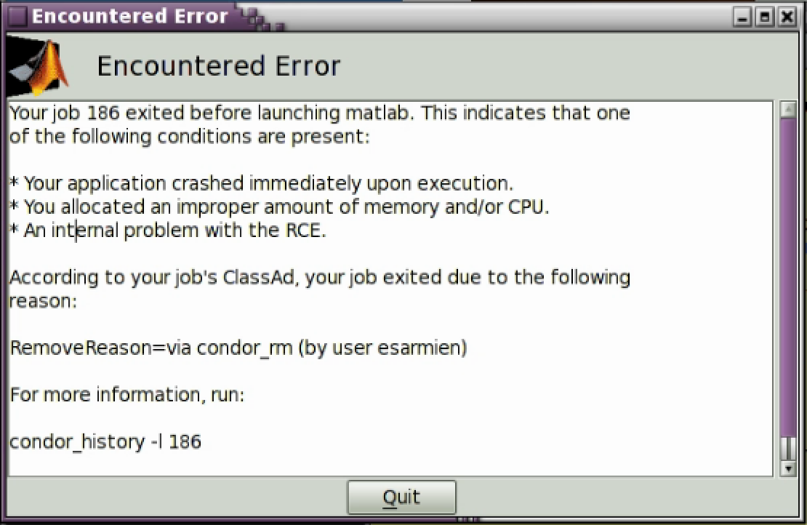

Diagnosing errors and warnings
=================================

Your job did not start, exited prematurely
------------------------------------------

This error indicates your job terminated immediately upon start or was
removed from the queue before it was started. The output includes a
``RemoveReason`` which may or may not be populated depending on the
error causing your application to exit prematurely. In this example, I
manually terminated the job before it began to run in order to produce
this error as an example.

Most likely, this error is caused by allocating **too few** cpus or
**too little** memory to an application, such that upon start it exits.

Your job took too long to start
-------------------------------

.. image:: ./_static/error-too-long.png
   :width: 400px
   :height: 100px

If you receive an error that your job took too long to start, this means
that:

* There are not enough resources in the cluster to start your job
* Your CPU and/or Memory requests are so high that they are unable to be
  satisfied.

You can check how much resources are available in the cluster by running
Applications |rarr| RCE Utilities |rarr| Show available RCE cluster
resources

If there are resources available, try lowering your CPU and memory
request and try again. If you **absolutely** need a large contiguous CPU
and memory request, you should try submitting your job as a `batch job
<http://projects.iq.harvard.edu/rce/book/batch-processing-basics>`_

Xpra took to long to start
--------------------------
If, while submitting your job, you encounter an error stating that Xpra
took too long to start, please e-mail
rce_services@help.hmdc.harvard.edu, including the entire output of the
error message.

Unknown exception
-----------------
If, while submitting your job, you encounter an unknown exception error,
please e-mail rce_services@help.hmdc.harvard.edu, including the entire
output of the error message.

.. |rarr| unicode:: U+2192 .. right arrow symbol

